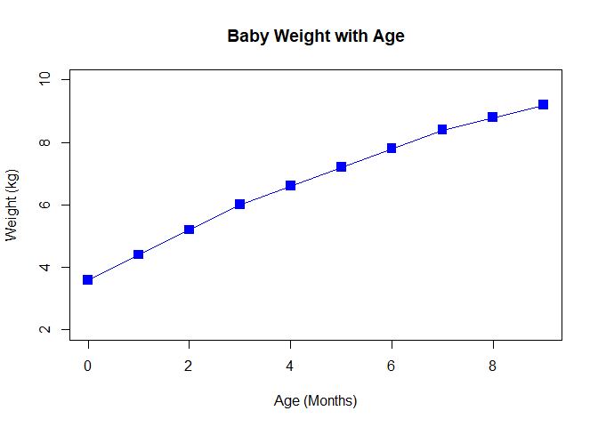

CLASS\_5: Data Visualization and Graphs in R
================

\#’ — \#’ title: “Class 5: Data Visualization and Graphs in R” \#’
author: “Berenice Ramirez Leal” \#’ date: “Jan 21st, 2020” \#’ —

# Class 5

# Data Visualization and graphs in R

``` r
# 1:10 denotes what the numbers on the axis, and typ is what type of plot I want, "o" is circles and lines connecting them 
plot (1:10, col="blue", typ="o")
```

<!-- -->

``` r
#header as T will give the first vlues as the names of the variables
read.table("bimm143_05_rstats/weight_chart.txt", header= T)
```

    ##    Age Weight
    ## 1    0    3.6
    ## 2    1    4.4
    ## 3    2    5.2
    ## 4    3    6.0
    ## 5    4    6.6
    ## 6    5    7.2
    ## 7    6    7.8
    ## 8    7    8.4
    ## 9    8    8.8
    ## 10   9    9.2

``` r
#Give the data a variable for easier use
baby <- read.table ("bimm143_05_rstats/weight_chart.txt", header= TRUE)
baby
```

    ##    Age Weight
    ## 1    0    3.6
    ## 2    1    4.4
    ## 3    2    5.2
    ## 4    3    6.0
    ## 5    4    6.6
    ## 6    5    7.2
    ## 7    6    7.8
    ## 8    7    8.4
    ## 9    8    8.8
    ## 10   9    9.2

``` r
# First position is x-axis, and second is y-axis, the $ is used to indicate what specific celd 
plot(baby$Weight, baby$Age)
```

<!-- -->

``` r
plot(baby$Age, baby$Weight)
```

<!-- --> \#\#PLOT

``` r
plot(baby$Age, baby$Weight, col="blue", 
     type="o", pch=15, cex=1.5, ylim = c(2,10), xlab="Age (Months)", 
     ylab="Weight (kg)", main="Baby Weight with Age")
```

<!-- -->

``` r
plot(1:5, cex=1:5, pch=1:5, ylim=c(1,20), xlim=c(0,50))
```

<!-- -->

``` r
#cex tells you how the data points will be changing along the axis, if 5:1 they will start big and then go small, if they are cex=1:5 they will start small then go big.

#pch changes the symbols used in the plot

#ylim means ylimits, what is the lowest and highest value in the y axis, and xlim is for the x-axis
```

\#\#Barplot

``` r
# Next example mouse genome features
# Put the information in a variable for easier use

mouse <- read.table("bimm143_05_rstats/feature_counts.txt", sep="\t", header=TRUE)
mouse
```

    ##                    Feature Count
    ## 1            Messenger RNA 79049
    ## 2         Coding Sequences 50770
    ## 3                    Genes 32029
    ## 4            Transfer RNAs 26248
    ## 5              CpG islands 13840
    ## 6              Pseudogenes  5195
    ## 7               Micro-RNAs  1638
    ## 8     Small nucleolar RNAs  1602
    ## 9       Small nuclear RNAs  1431
    ## 10       Miscellaneous RNA   491
    ## 11 Immunoglobulin Segments   474
    ## 12          Ribosomal RNAs   341

``` r
# sep is used to separate the cells in the table, without it the information would be all gathered together. It formats the content in the table
```

``` r
#Generates the barplot
barplot(mouse$Count)
```

<!-- -->

``` r
barplot(mouse$Count, horiz = TRUE, col="lightpink", 
        names.arg = mouse$Feature, las=1)
```

<!-- -->

``` r
##horiz makes the graph to have the names.arg in the y-axis, so the bars will be depicted horizontally 

##names.arg will depict the names you want in the horizontal axis, if instead of Feature, I choose Count, the numbers will be shown
```

``` r
par(mar=c(5,11,0,1))

barplot(mouse$Count, horiz = TRUE, col="lightpink", 
        names.arg = mouse$Feature, las=1)
```

<!-- -->

``` r
par(mar=c(5,4,2,2))
```

par(mar=c(5.1, 4.1, 4.1, 2.1), mgp=c(3, 1, 0), las=0) \#\# par sets or
adjusts plotting parameters. Here we consider the following three
parameters:

## margin size (mar) :

A numeric vector of length 4, which sets the margin sizes in the
following order: bottom, left, top, and right. The default is c(5.1,
4.1, 4.1, 2.1).

## axis label locations (mgp) :

A numeric vector of length 3, which sets the axis label locations
relative to the edge of the inner plot window. The first value
represents the location the labels (i.e. xlab and ylab in plot), the
second the tick-mark labels, and third the tick marks. The default is
c(3, 1, 0).

## and axis label orientation (las) :

A numeric value indicating the orientation of the tick mark labels and
any other text added to a plot after its initialization. The options are
as follows: always parallel to the axis (the default, 0), always
horizontal (1), always perpendicular to the axis (2), and always
vertical (3).

## COLOR VECTORS - Section 3

``` r
mf <- read.delim("bimm143_05_rstats/male_female_counts.txt")
mf 
```

    ##       Sample Count
    ## 1    D1 Male     2
    ## 2  D1 Female     1
    ## 3    D2 Male     2
    ## 4  D2 Female     3
    ## 5    D3 Male     3
    ## 6  D3 Female     6
    ## 7    D4 Male     5
    ## 8  D4 Female    10
    ## 9    D5 Male     9
    ## 10 D5 Female    18

``` r
barplot(mf$Count, names.arg=mf$Sample, col=rainbow(10))
```

<!-- -->

``` r
#Another plot of the same thing with different colors, col=rainbow number inside gives the # of colors in the plot
```

``` r
barplot(mf$Count, names.arg=mf$Sample, col=c("red","blue", "darkgreen"))
```

<!-- -->

``` r
#Here I specified what colors I want in my plot. 
# AS A SIDE NOTE CLICKING SOURCE WILL RUN EVERYTHING AGAIN
```
